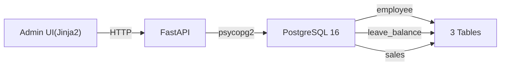

# ex02 사내 CRUD 시스템

> 사내 AI 비서 — CH02 "일단 사내 시스템부터" 실습 코드

## 목적 및 학습 목표

- FastAPI + PostgreSQL을 사용하여 실무형 CRUD 시스템을 구축한다
- Pydantic 스키마로 요청/응답 데이터를 검증하는 방법을 익힌다
- Jinja2 템플릿 엔진으로 서버사이드 렌더링 Admin UI를 구현한다
- Docker Compose로 PostgreSQL을 실행하고 데이터베이스 연결을 관리한다

## 실행 환경

- Python 3.10+
- Docker Desktop (PostgreSQL 컨테이너 실행용)
- psycopg2, FastAPI, Jinja2

## 전제 조건 — 인프라 실행 (최초 1회)

PostgreSQL 컨테이너를 먼저 실행합니다. 이 단계는 이 폴더 내에서 수행합니다.

```bash
docker-compose up -d
```

> PostgreSQL 16이 시작되고 `data/schema.sql`이 자동으로 실행됩니다.
> 직원 5명, 매출 10건의 시드 데이터가 입력됩니다.

컨테이너 상태를 확인합니다.

```bash
docker-compose ps
```

기대 출력:

```
NAME              STATUS
metacoding_db     running (healthy)
```

## 설치 및 실행

이 챕터의 예제 코드를 클론합니다.

```bash
git clone https://github.com/{repo}/ex02
cd ex02
```

환경 변수를 설정합니다.

```bash
cp .env.example .env
# .env 파일은 docker-compose 기본값과 동일하므로 별도 수정 불필요
```

### macOS / Linux

```bash
python3 -m venv venv
source venv/bin/activate
pip install -r requirements.txt
```

### Windows

```bash
python -m venv venv
venv\Scripts\activate
pip install -r requirements.txt
```

## 실행

```bash
python -m uvicorn app.main:app --reload --host 0.0.0.0 --port 8000
```

또는

```bash
python app/main.py
```

## 기대 출력

<!-- [CAPTURE NEEDED: 터미널 전체 화면 — uvicorn 시작 후 정상 동작 상태] -->

```
=======================================================
  사내 AI 비서 — CRUD 시스템 (ex02)
  Admin UI : http://localhost:8000/admin/dashboard
  API 문서 : http://localhost:8000/docs
=======================================================
INFO:     Will watch for changes in these directories: ['/path/to/ex02']
INFO:     Uvicorn running on http://0.0.0.0:8000 (Press CTRL+C to quit)
INFO:     Started reloader process [12345] using WatchFiles
INFO:     Started server process [12346]
INFO:     Waiting for application startup.
INFO:     Application startup complete.
```

브라우저에서 아래 URL로 접속합니다.

| URL | 설명 |
|-----|------|
| http://localhost:8000/admin/dashboard | Admin 대시보드 |
| http://localhost:8000/admin/employees | 직원 관리 |
| http://localhost:8000/admin/leaves | 휴가 관리 |
| http://localhost:8000/admin/sales | 매출 관리 |
| http://localhost:8000/docs | Swagger API 문서 |

## 전체 구조



```
ex02/
├── README.md
├── requirements.txt
├── .env.example
├── docker-compose.yml        # PostgreSQL 16 컨테이너
├── data/
│   └── schema.sql            # DDL + 시드 데이터 (직원 5명, 매출 10건)
├── app/
│   ├── __init__.py
│   ├── main.py               # FastAPI 앱 + 라우터 등록
│   ├── database.py           # psycopg2 연결 컨텍스트 매니저
│   ├── models.py             # 도메인 dataclass (Employee, LeaveBalance, Sale)
│   ├── schemas.py            # Pydantic 요청/응답 스키마
│   ├── crud.py               # DB CRUD 함수
│   ├── views.py              # Jinja2 Admin UI 라우터 (/admin/*)
│   └── api.py                # REST JSON API 라우터 (/api/*)
├── templates/
│   ├── base.html             # 공통 레이아웃 (사이드바 + 메인)
│   ├── dashboard.html        # 통계 카드 + 최근 매출
│   ├── employees.html        # 직원 CRUD UI
│   ├── leaves.html           # 휴가 관리 UI
│   └── sales.html            # 매출 관리 UI
├── static/
│   └── css/
│       └── style.css         # Inter 폰트, 검정/흰색 + 금색 디자인
└── outputs/                  # 실행 결과물 저장 (.gitignore 대상)
```

## 중단 방법

FastAPI 서버: `Ctrl+C`

PostgreSQL 컨테이너 중단:

```bash
docker-compose down
```

데이터까지 완전 삭제:

```bash
docker-compose down -v
```
