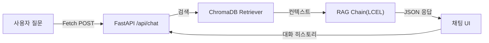

# ex05 RAG Q&A 엔진

> 사내 AI 비서 — 사내 문서 기반 RAG Q&A 엔진 (ex05 실습 코드)

## 학습 목표

- LCEL(LangChain Expression Language) 파이프 연산자로 RAG 체인을 조립하는 방법을 이해한다
- "출처 강제 + 모르면 확인되지 않음" 프롬프트 설계 패턴을 적용한다
- FastAPI + Jinja2 기반 채팅 웹 UI(Fetch POST 방식)를 구현한다
- WindowMemory로 멀티턴 대화를 관리한다

## 실행 환경

- Python 3.10+
- Ollama (로컬 LLM, 기본값) 또는 OpenAI API (선택)
- ChromaDB (ex04에서 생성한 데이터 또는 data/docs/ 자동 구축)

## 독립 실행 안내

ex04의 ChromaDB가 없어도 실행할 수 있습니다. `data/chroma_db/` 폴더가 비어 있으면 `data/docs/`의 원본 문서(PDF/DOCX/XLSX 6종)를 자동으로 파싱·청킹·임베딩하여 ChromaDB를 구축합니다.

## 설치 및 실행

이 챕터의 예제 코드를 클론합니다.

```bash
git clone https://github.com/{repo}/ex05-rag-qa-engine
cd ex05-rag-qa-engine
```

환경 변수를 설정합니다.

```bash
cp .env.example .env
# .env 파일을 열어 LLM_PROVIDER와 관련 키를 입력합니다.
```

### macOS / Linux

```bash
python3 -m venv venv
source venv/bin/activate
pip install -r requirements.txt
```

### Windows (WSL2)

```bash
python -m venv venv
venv\Scripts\activate
pip install -r requirements.txt
```

## 실행

```bash
python -m app.main
```

브라우저에서 `http://localhost:8000/chat` 을 열면 채팅 UI가 실행됩니다.

## 예상 출력

<!-- [CAPTURE NEEDED: 브라우저에서 채팅 UI가 표시된 전체 화면] -->

서버 시작 시 터미널 출력:

```
[INFO] 서버 시작: http://0.0.0.0:8000
[INFO] 채팅 UI: http://localhost:8000/chat
[INFO] ChromaDB 로드: ./data/chroma_db
INFO:     Uvicorn running on http://0.0.0.0:8000 (Press CTRL+C to quit)
```

ChromaDB가 없을 때 자동 구축:

```
[INFO] ChromaDB가 없습니다. data/docs/ 원본 문서에서 자동 구축합니다.
[INFO] ChromaDB 자동 구축 완료: 17건 → ./data/chroma_db
```

채팅 질문 예시 (브라우저에서):

```
질문: 병가 신청 시 증빙 서류가 필요한가요?
AI:  3일 미만 병가는 증빙 서류가 불필요하며, 3일 이상 병가는 의사소견서를 제출해야 합니다.
     [출처: HR_취업규칙_v1.0]
```

> 위 출력은 실제 실행 결과를 그대로 옮긴 것입니다. 터미널 출력과 한 글자씩 대조하여 디버깅에 활용하십시오.

## 전체 구조



## 파일 구조

```
ex05/
├── README.md
├── requirements.txt
├── .env.example
├── src/
│   ├── __init__.py
│   ├── rag_chain.py          # LCEL 기반 RAG 체인
│   ├── response_parser.py    # 답변 + 출처 파서
│   └── conversation.py       # 멀티턴 대화 히스토리 관리
├── app/
│   ├── __init__.py
│   ├── main.py               # FastAPI 앱 + 페이지 라우터
│   ├── chat_api.py           # /api/chat 엔드포인트
│   └── session.py            # 세션 ID 관리
├── templates/
│   ├── base.html             # 좌측 사이드바 레이아웃 (ex02 동일)
│   └── chat.html             # 채팅 UI (ex02 qa.html 기반)
├── static/
│   ├── css/
│   │   ├── style.css         # 전역 스타일 (ex02 admin.css 기반)
│   │   └── chat.css          # 채팅 전용 스타일 (ex02 qa.css 기반)
│   └── js/
│       └── chat.js           # Fetch 기반 채팅 로직 (ex02 qa.js 패턴)
├── data/
│   ├── docs/                 # 원본 문서 (PDF/DOCX/XLSX, ex04와 동일)
│   └── chroma_db/            # ChromaDB (없으면 data/docs/에서 자동 구축)
└── outputs/
    └── .gitkeep
```
