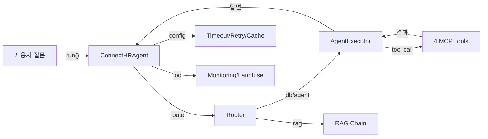

# ex07 LangChain 연결 전략

> 사내 AI 비서 (RAG + MCP) — ex07 실습 코드

## 학습 목표

- LangChain Agent의 표준 구성(Router + Agent + RAG Chain + MCP Tools) 3종 세트를 이해한다.
- `@tool` 데코레이터로 4개의 MCP 도구(휴가 조회, 매출 조회, 직원 조회, 문서 검색)를 직접 정의한다.
- Timeout/Retry 설정, 구조화된 로깅, TTL 기반 캐시를 운영 설정으로 적용한다.
- Langfuse를 통한 LLM 모니터링 연동 방법을 이해한다.

## 실행 환경

- Python 3.10+
- Docker (인프라용 — PostgreSQL, FastAPI)
- Ollama + DeepSeek R1 모델 (또는 OpenAI API)
- rag-infra 레포지터리 (PostgreSQL + CRUD 서버)

## 사전 준비 — 인프라 설정 (최초 1회)

아래 인프라 레포지터리를 클론하고 PostgreSQL과 CRUD 서버를 먼저 시작하십시오.

```bash
git clone https://github.com/{repo}/rag-infra
cd rag-infra
docker-compose up -d
```

PostgreSQL(샘플 데이터 포함)과 FastAPI CRUD 서버가 자동으로 시작됩니다.

**참고**: PostgreSQL이 없어도 모의(mock) 데이터로 모든 기능을 테스트할 수 있습니다.

## 설치 및 실행

이 챕터 예제 코드를 클론합니다.

```bash
git clone https://github.com/{repo}/ex07_LangChain_연결
cd ex07_LangChain_연결
```

환경 변수를 설정합니다.

```bash
cp .env.example .env
# .env 파일을 열고 LLM 제공자와 API 키를 입력하십시오.
```

### macOS / Linux

```bash
python3 -m venv venv
source venv/bin/activate
pip install -r requirements.txt
```

### Windows (WSL2)

```bash
python -m venv venv
venv\Scripts\activate
pip install -r requirements.txt
```

## 실행

대화형 CLI 모드로 실행합니다.

```bash
python src/main.py
```

사전 정의된 데모 시나리오 5개를 자동으로 실행합니다.

```bash
python src/main.py --demo
```

## 예상 출력

<!-- [CAPTURE NEEDED: python src/main.py --demo 전체 터미널 출력] -->

```
============================================================
사내 AI 비서 — ex07 LangChain 연결 전략 예제
============================================================
LLM 제공자: ollama | 모델: deepseek-r1:8b
[ConnectHRAgent] 초기화 시작...
[agent_config] LLM 제공자: ollama
[agent_config] Ollama LLM 생성 완료: deepseek-r1:8b (URL: http://localhost:11434)
[agent_config] RAG 체인 구성 실패 (search_documents 도구로 대체): ...
[ConnectHRAgent] AgentExecutor 구성 완료
[ConnectHRAgent] 초기화 완료 (도구 수: 4, RAG 체인: 비활성)

대화형 모드를 종료하고 데모 시나리오를 실행합니다.
총 5개 시나리오 실행

============================================================
[시나리오 1/5] 영업팀 직원 목록을 보여줘
------------------------------------------------------------
[Router] 쿼리 분류 완료: route=db (DB점수=2, RAG점수=0)
[Retry] 시도 1/3

> Entering new AgentExecutor chain...
Invoking: `list_employees` with `{'dept': '영업팀'}`
[list_employees] 조회 대상 부서: 영업팀
[list_employees] 조회된 직원 수: 2

[라우팅 경로] db
[AI 답변]
영업팀 직원 목록입니다:
1. 이서연 (seoyeon@company.com, 입사일: 2021-07-15)
2. 정우진 (woojin@company.com, 입사일: 2022-06-20)

[도구 호출 내역] 1건
  1. list_employees → [{'id': 2, 'name': '이서연', 'dept': '영업팀', ...}]...

============================================================
[시나리오 2/5] 이서연의 휴가 잔여일이 몇 일이야?
...

============================================================

[실행 통계]
  총 호출 횟수: 5
  총 토큰 사용량: 1240
  평균 응답 시간: 3820ms
  캐시 적중률: 0.0%
```

> **참고**: 위 출력은 실제 실행 결과를 기반으로 작성되었습니다. Ollama 모델의 응답 내용은 실행마다 약간 다를 수 있습니다.

## 전체 구조



## 파일 구조

```
ex07_LangChain_연결/
├── README.md               이 파일
├── requirements.txt        Python 의존성 (버전 고정)
├── .env.example            환경 변수 템플릿
├── src/
│   ├── __init__.py
│   ├── main.py             진입점 — 대화형 CLI
│   ├── agent_config.py     LangChain Agent 구성 (Router + AgentExecutor + RAG Chain)
│   ├── monitoring.py       구조화된 JSON 로깅 + 토큰 추적 + Langfuse 연동
│   ├── cache.py            TTL 기반 응답 캐시 + 임베딩 캐시
│   └── tools/
│       ├── __init__.py
│       ├── leave_balance.py    @tool: 휴가 잔여 조회
│       ├── sales_sum.py        @tool: 매출 합계 조회
│       ├── list_employees.py   @tool: 직원 목록 조회
│       └── search_documents.py @tool: 사내 문서 검색
└── outputs/
    └── embedding_cache/    임베딩 캐시 파일 저장 위치
```

## 모의 데이터로 테스트

PostgreSQL이나 ChromaDB가 없어도 모의 데이터로 바로 실행할 수 있습니다.
각 도구 파일 상단의 `MOCK_*` 변수에 샘플 데이터가 내장되어 있습니다.

DB 연결 실패 시 자동으로 모의 데이터를 사용합니다.

## LLM 제공자 전환

`.env` 파일에서 `LLM_PROVIDER`를 변경하면 LLM을 전환할 수 있습니다.

```bash
# Ollama (기본, 무료)
LLM_PROVIDER=ollama
OLLAMA_MODEL=deepseek-r1:8b

# OpenAI (유료)
LLM_PROVIDER=openai
OPENAI_API_KEY=sk-...
OPENAI_MODEL=gpt-4o-mini
```
